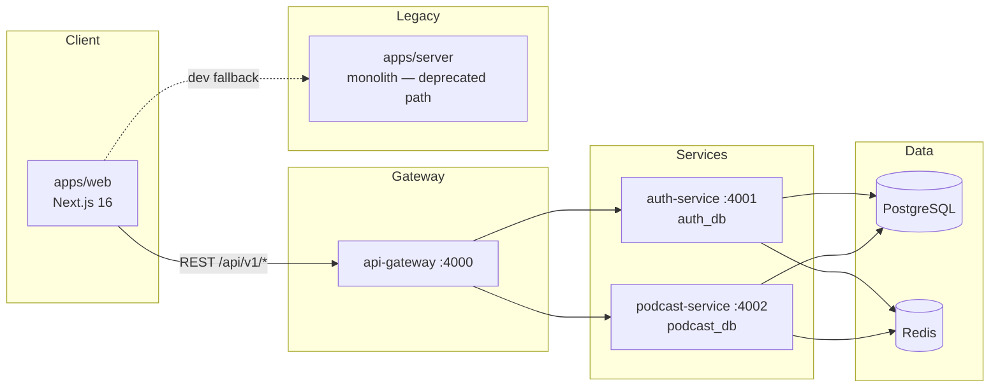

# Project Progress: Convo-AI-Studio

**Last updated:** June 21, 2026

Convo-AI-Studio is a production-grade, AI-powered realtime podcast platform. The codebase is actively migrating from a monolithic Fastify backend (`apps/server`) toward a **database-per-service microservices architecture** aligned with `AGENTS.md`.

---

## Overall Status

| Area | Status | Notes |
|------|--------|-------|
| Monorepo & workspace | ✅ Done | `pnpm` workspaces: `apps/*`, `services/*`, `packages/*` |
| Frontend UI | 🟡 Partial | Rich static/mock UI; limited live API wiring |
| Auth microservice | ✅ Done | Isolated DB, JWT + Redis sessions |
| Podcast microservice | 🟡 Partial | Channels & podcasts CRUD; mock AI pipeline |
| API Gateway | 🟡 Partial | Reverse proxy + rate limit; no GraphQL yet |
| Legacy monolith (`apps/server`) | ⚠️ Legacy | Superset of features; being replaced |
| Realtime service | ❌ Not started | WebSockets / WebRTC not implemented |
| AI engine (Python) | ❌ Not started | No gRPC, LangChain, or workers |
| Shared packages (`proto-contracts`, etc.) | ❌ Not started | `packages/` directory empty |
| Infra (k8s, monitoring) | ❌ Not started | `infra/` directory empty |
| CI/CD & tests | ❌ Not started | No GitHub Actions or test suites |

---

## Architecture Snapshot



**Target architecture** (from `AGENTS.md`): GraphQL federation at the gateway, gRPC to a Python `ai-engine`, BullMQ workers, dedicated `realtime-service`, and strict cross-service logical references only. Current implementation covers the first hop (gateway → REST microservices).

---

## Completed Work

### 1. Microservices Foundation

#### API Gateway (`services/api-gateway`)
- Central entry on port **4000** with `@fastify/reply-from` reverse proxy
- Routes:
  - `/api/v1/auth/*` → auth-service
  - `/api/v1/channels/*` → podcast-service
  - `/api/v1/podcasts/*` → podcast-service
- Security middleware: Helmet, CORS, rate limiting (100 req/min)
- Health check: `GET /health`

#### Auth Service (`services/auth-service`)
- **Isolated database:** `auth_db` (PostgreSQL)
- **Prisma models:** `User`, `Session` with `Role` enum (`USER`, `CREATOR`, `ADMIN`)
- **Three-layer pattern:** repository → service → controller
- **Endpoints** (`/api/v1/auth`):
  - `POST /register`, `POST /login`
  - `POST /refresh`, `POST /logout`, `GET /me` (authenticated)
- **Auth flow:** Argon2 password hashing, JWT access tokens, HttpOnly cookies, **Redis-backed session store** (30-day TTL, refresh token rotation)
- Docker image + migration: `20260621100527_init_auth_service_db`

#### Podcast Service (`services/podcast-service`)
- **Isolated database:** `podcast_db` (PostgreSQL)
- **Prisma models:** `Channel`, `ChannelSubscription`, `Podcast`
- Enums: `PodcastStatus` (DRAFT, PROCESSING, PUBLISHED, FAILED), `Visibility` (PUBLIC, PRIVATE, UNLISTED)
- **Database-per-service compliance:** `ownerId` and `userId` are scalar references (no FK to auth DB); only intra-service FK is `Podcast.channelId → Channel`
- **Three-layer pattern** for channels and podcasts
- **Channel endpoints** (`/api/v1/channels`):
  - CRUD, `/me`, subscribe/unsubscribe, subscriptions list, `isSubscribed`
  - `channelowner` middleware for owner-only mutations
- **Podcast endpoints** (`/api/v1/podcasts`):
  - `POST /podcast`, `GET /podcast/:id`, `GET /podcast/channel/:channelId`
- **Mock AI pipeline:** 15s timeout → sets status `PUBLISHED` with placeholder audio URL (no real LLM/TTS)
- Docker image + migration: `20260621163423_add_foregin_key`

### 2. Local Infrastructure (`docker-compose.yaml`)
- **PostgreSQL 16** and **Redis 7** on shared `convo-network`
- Containerized: `api-gateway`, `auth-service`, `podcast-service`
- Separate Redis DB indices per service (`REDIS_DB=0` auth, `REDIS_DB=1` podcast)

### 3. Frontend (`apps/web`)
- **Stack:** Next.js 16 (App Router), React 19, TailwindCSS 4, Framer Motion, Zustand, Axios
- **Live API integration:**
  - Auth store (`store/authStore.ts`): register, login, logout, session check via gateway
  - Profile page: fetch/create channels through `/api/v1/channels`
- **Pages built (mostly static/mock data):**
  - Landing (`Hero`, `Features`, `HowItWorks`, `TopPodcasts`, `CTASection`, Spline 3D)
  - Auth: `/login`, `/sign-up`
  - Discover: search hero, category filters, trending, regional sections, top creators
  - Channels: list, detail `[slug]`, activity hub, subscribed channels
  - Podcast detail `[slug]`: player, engagement, comments, related sidebar
  - Feed and Profile (tabs: history, watch-later, channels)
- **Design system:** Dark premium theme, liquid-glass UI, shared `Button`, `BeamBg` components

### 4. Legacy Monolith (`apps/server`) — Still Present
- Original all-in-one Fastify server with auth, channels, and podcasts
- **Extended schema** not yet ported to microservices:
  - `WatchHistory`, `PodcastVote`, `SavedPodcast`
  - Cross-model relations partially removed (`20260621084555_break_foreign_relations`)
- Apollo Server + GraphQL listed in `package.json` but **not wired** in `app.ts`
- Functionally duplicated by auth-service + podcast-service; treat as **migration source**, not target

### 5. Documentation & Governance
- `README.md`: product vision, NFRs, architecture diagrams, setup guide
- `AGENTS.md`: target microservices blueprint, database isolation rules, service boundaries

---

## In Progress / Partial

| Item | Detail |
|------|--------|
| Frontend ↔ backend wiring | Only auth + channel management hit live APIs; discover, feed, channel detail, and podcast pages use mock data |
| Auth DB migrations | Initial migration schema (`password`, no `username`/`firstName`) may be out of sync with current Prisma schema — verify before deploy |
| Docker CMD paths | Auth Dockerfile references `dist/index.js`; service entry is `dist/server.js` — likely needs fix |
| Monolith deprecation | `apps/server` still in workspace; no formal cutover or data migration script |
| README vs reality | README describes GraphQL playground and single `apps/server`; actual dev path is gateway + microservices |

---

## Not Started (Target from AGENTS.md)

### Services
- **`realtime-service`** — WebSockets, live reactions, WebRTC signaling
- **`ai-engine`** (Python/FastAPI) — multi-agent orchestration, LangChain, gRPC server, Celery/BullMQ workers

### Platform Capabilities
- GraphQL / Mercurius at API gateway (federation, schema stitching)
- gRPC contracts in `packages/proto-contracts`
- BullMQ job queues for AI synthesis, analytics, notifications
- AI character library (`ai_characters`, turn manager, memory store)
- Live podcast streaming (token streaming, audience Q&A, polls)
- Vector search / RAG for transcripts
- WebRTC audio streaming

### Engineering
- Shared packages: `ts-config`, `ui`, `utils`
- Kubernetes manifests (`infra/k8s/`)
- Observability stack (`infra/monitoring/` — Prometheus, Grafana, OpenTelemetry)
- GitHub Actions CI (lint, typecheck, integration tests)
- Automated or manual test suites

---

## Functional Requirements Coverage

| ID | Requirement | Status |
|----|-------------|--------|
| FR-01 | Creators create/edit/delete channels | ✅ Via podcast-service |
| FR-02 | Schedule podcast with start/end timestamps | ❌ Not implemented |
| FR-03 | Stream AI text to participants via WebSocket | ❌ Not implemented |
| FR-04 | Audience reactions and questions in real time | ❌ UI mock only |
| FR-05 | Persist messages to PostgreSQL | ❌ No `messages` model yet |
| FR-06 | Post-podcast analytics & email workers | ❌ Not implemented |
| FR-07 | Admin manage AI characters without redeploy | ❌ Not implemented |

---

## Recommended Next Steps

1. **Finish microservices cutover** — Retire `apps/server`; port `WatchHistory`, votes, and saved podcasts into appropriate services; add missing auth schema migration.
2. **Wire frontend to live APIs** — Replace mock data on discover, feed, channel detail, and podcast pages with gateway calls.
3. **Fix Docker/build issues** — Align Dockerfiles, env examples, and root `package.json` scripts for one-command local dev.
4. **Introduce async AI pipeline** — BullMQ queue in podcast-service → stub Python `ai-engine` gRPC contract.
5. **Add `realtime-service`** — WebSocket room per podcast; gateway stays stateless.
6. **GraphQL read layer** — Mercurius at gateway for aggregated reads (user + channel + podcast stitching).
7. **CI baseline** — Lint, typecheck, and smoke tests for auth + channel flows.

---

## Tech Stack (Current)

| Layer | Technology |
|-------|------------|
| Monorepo | pnpm workspaces |
| Frontend | Next.js 16, React 19, TailwindCSS 4, Zustand, Axios |
| Gateway | Fastify 5, `@fastify/reply-from`, rate-limit, Helmet |
| Microservices | Fastify 5, Prisma 7, PostgreSQL, Redis, Argon2, JWT |
| Containers | Docker Compose (Postgres 16, Redis 7) |
| Legacy | `apps/server` (Fastify monolith, unused GraphQL deps) |

---

## Local Development (Current Path)

```bash
# Infrastructure
docker-compose up -d postgres redis

# Run migrations (per service)
cd services/auth-service && pnpm db:migrate
cd services/podcast-service && pnpm db:migrate

# Start services (separate terminals or use pnpm filters)
pnpm --filter api-gateway dev      # :4000
pnpm --filter @convoai/auth-service dev  # :4001
pnpm --filter podcast-service dev  # :4002
pnpm --filter web dev              # :3000
```

Set `NEXT_PUBLIC_BASE_URL=http://localhost:4000/api` for the frontend.

---

## Summary

The project has made substantial progress on **service decomposition** and **frontend UI scaffolding**. Auth and channel/podcast REST APIs run as isolated microservices behind an API gateway, following database-per-service boundaries. The core product differentiators — live multi-agent AI discussions, realtime audience interaction, and production AI/audio pipelines — remain **future work**. The legacy monolith and mock-heavy frontend should be the focus of the next integration sprint.
