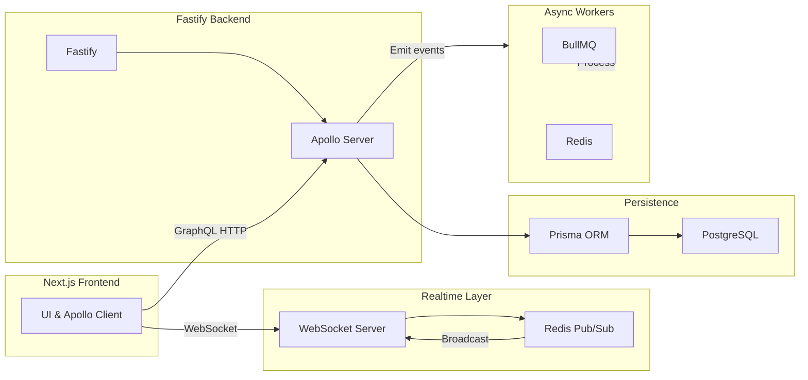
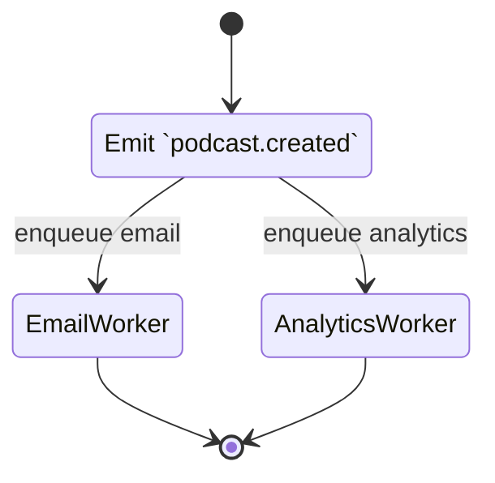

# Convo-AI-Studio

---

## 1. Project Overview
Convo-AI-Studio is a production‑grade, AI‑powered realtime podcast platform. It enables creators to host live, multi‑agent discussions on user‑defined topics, while audiences can interact, react, and replay transcripts. The system is built for high scalability, low latency, and extensibility across distributed environments.

---

## 2. Vision & Goals
- **Scalable Real‑time AI Orchestration** – support thousands of concurrent participants with low‑latency audio‑like streams.
- **Event‑Driven Extensibility** – plug‑in new AI personalities, analytics, and notification workers without code changes.
- **Developer‑Centric Platform** – well‑typed APIs, clear domain boundaries, and reproducible local development.
- **Robust Production Readiness** – observability, fault‑tolerance, and security baked in from day 1.

---

## 3. Core Features
- **Channel Management** – creators can configure broadcasting identities and schedule sessions.
- **Live Podcast Engine** – real‑time AI conversation, audience reaction, and question handling.
- **AI Character Library** – define personalities, tone, and behavior via modular prompts.
- **Realtime Transcripts & Replay** – persistent message storage with searchable transcripts.
- **Audience Participation** – live reactions, Q&A, and poll integration.
- **Background Workers** – scheduled notifications, analytics, and media processing.

---

## 4. Functional Requirements
| ID | Description |
|----|-------------|
| FR‑01 | Creators can create, edit, and delete channels. |
| FR‑02 | Creators schedule a podcast with start/end timestamps. |
| FR‑03 | System streams AI‑generated audio‑like text to participants via WebSocket. |
| FR‑04 | Audience can send reactions and questions in real time. |
| FR‑05 | All messages are persisted to PostgreSQL for later replay. |
| FR‑06 | Workers process post‑podcast analytics and email notifications. |
| FR‑07 | Admin can add, update, or remove AI characters without redeploy. |

---

## 5. Non‑Functional Requirements
- **Performance** – end‑to‑end latency < 150 ms for AI message delivery.
- **Scalability** – horizontal scaling to 10k concurrent connections.
- **Reliability** – 99.9 % uptime, graceful degradation on downstream failures.
- **Security** – JWT authentication, RBAC, encrypted data at rest & in transit.
- **Observability** – structured logs, OpenTelemetry tracing, Prometheus metrics.
- **Maintainability** – TypeScript strict mode, modular services, CI/CD pipeline.

---

## 6. System Architecture


---

## 7. High‑Level Design
- **Domain‑Driven Modules** – `users`, `channels`, `podcasts`, `messages`, `aiCharacters`, each with its own service layer.
- **Separate Concerns** – Routes only handle request/response mapping; business logic lives in `services/`.
- **GraphQL Schema** – strongly typed API exposing queries, mutations, and subscriptions for realtime updates.
- **Event Bus** – internal `EventEmitter` and Redis Pub/Sub for cross‑service communication.
- **Worker Architecture** – BullMQ queues per domain (e.g., `analytics`, `email`, `transcode`).

---

## 8. Event‑Driven Architecture

Events flow from the API layer to consumers, enabling loose coupling and easy extension.

---

## 9. Realtime Architecture
- **WebSocket Server** (Fastify plugin) handles client connections.
- **Redis Pub/Sub** backs the broadcast channel, allowing multiple backend instances to share realtime streams.
- **Apollo Subscriptions** expose GraphQL‑based realtime feeds for UI components.

---

## 10. AI Orchestration Design
1. **Prompt Provider Service** – assembles prompts from character templates and conversation context.
2. **Turn Manager** – maintains per‑podcast turn state, ensuring orderly AI speaking turns.
3. **Memory Store** – short‑term memory cached in Redis, long‑term persisted in PostgreSQL.
4. **External LLM Integration** – abstracted via a provider interface (e.g., OpenAI, Anthropic).

---

## 11. Database Design (PostgreSQL)
| Table | Primary Key | Core Columns |
|-------|-------------|--------------|
| users | id (uuid) | email, name, role, createdAt |
| channels | id (uuid) | ownerId (FK), name, description |
| podcasts | id (uuid) | channelId (FK), scheduledAt, status |
| messages | id (uuid) | podcastId (FK), authorId (FK), content, createdAt |
| ai_characters | id (uuid) | name, personalitySpec, createdAt |
| podcast_participants | id (uuid) | podcastId (FK), aiCharacterId (FK) |

Indexes on foreign keys and timestamp columns support efficient timeline queries and participant lookups.

---

## 12. Monorepo Structure
```
ai-podcast/
├─ apps/
│  ├─ web/          # Next.js frontend
│  └─ server/        # Fastify backend & GraphQL
├─ packages/
│  ├─ prisma/        # Prisma schema & migrations
│  ├─ ui/            # Shared UI components (React)
│  └─ utils/         # Common utilities (logging, validation)
├─ docker/
│  └─ Dockerfile
├─ docker-compose.yaml
└─ README.md
```
Each package is versioned independently, enabling isolated CI pipelines.

---

## 13. Tech Stack Justification
| Layer | Technology | Reasoning |
|-------|------------|-----------|
| Frontend | Next.js (React, SSR) | SEO‑friendly, type‑safe, built‑in routing |
| UI | TailwindCSS | Rapid, consistent styling without CSS bloat |
| Package Manager | pnpm | Fast, disk‑space‑efficient, great for monorepos |
| Backend | Fastify | Minimal overhead, plugin ecosystem, excellent for high‑throughput APIs |
| GraphQL | Apollo Server | Strong typing, subscription support, client caching |
| ORM | Prisma | Type‑safe DB access, migration tooling |
| DB | PostgreSQL | ACID guarantees, robust relational features |
| Cache & Pub/Sub | Redis | Low‑latency in‑memory store, supports both caching and Pub/Sub |
| Queue | BullMQ | Mature, Redis‑backed job queue with retries & concurrency control |
| Containerization | Docker & Docker‑Compose | Consistent dev / prod environments |
| Language | TypeScript | Compile‑time safety across the stack |

---

## 14. Constraints & Assumptions
- **Assume** availability of an LLM endpoint with deterministic latency.
- **Constraint**: All services run within Docker containers for reproducibility.
- **Assume** PostgreSQL is hosted on a managed instance with backups.
- **Constraint**: No server‑side rendering of AI responses (handled via GraphQL & workers).

---

## 15. Security Considerations
- **Authentication** – JWT signed with RSA keys, stored in HttpOnly cookies.
- **Authorization** – RBAC middleware at route level, enforced in GraphQL resolvers.
- **Input Validation** – Zod schemas for all external payloads.
- **Transport Security** – HTTPS enforced via reverse‑proxy (Traefik/Nginx).
- **Secrets Management** – `.env` files excluded from repo; Docker secrets for production.
- **Rate Limiting** – Fastify rate‑limit plugin to protect against abuse.

---

## 16. Scalability Considerations
- **Stateless API** – Fastify instances can be autoscaled behind a load balancer.
- **Horizontal Pub/Sub** – Redis cluster enables scaling WebSocket broadcasts.
- **Partitioned Queues** – BullMQ can shard jobs per podcast ID to avoid hot spots.
- **Database Sharding** – Future PostgreSQL logical sharding for tenant isolation.
- **Cachable Reads** – Frequently accessed metadata cached in Redis with TTL.

---

## 17. Trade‑offs & Engineering Decisions
| Decision | Trade‑off |
|----------|----------|
| Use GraphQL over REST | Adds complexity but gives flexible queries and realtime subscriptions |
| Central Redis for both cache & Pub/Sub | Simplifies infra but may require scaling Redis cluster under heavy load |
| BullMQ (Redis‑based) vs. external queue (e.g., RabbitMQ) | Lower operational overhead, but ties queue reliability to Redis health |
| Monorepo vs. multi‑repo | Easier cross‑package refactoring, but larger CI pipeline size |

---

## 18. Development Workflow / SDLC
1. **Feature Branch** – Gitflow style branching.
2. **Pre‑commit** – ESLint, Prettier, and TypeScript type‑checking.
3. **CI** – GitHub Actions run lint, unit tests, and integration tests.
4. **Docker Compose** – `docker-compose up -d` spins up Postgres, Redis, API, and UI for local dev.
5. **Code Review** – Mandatory PR review with static analysis checklist.
6. **Deploy** – Docker images pushed to registry, Helm chart used for Kubernetes rollout.

---

## 19. Local Setup Instructions
```bash
# Clone repository
git clone <repo-url>
cd ai-podcast

# Install dependencies (uses pnpm workspace)
pnpm install

# Set up environment variables
cp apps/server/.env.example apps/server/.env
# Edit .env with your local PostgreSQL & Redis credentials

# Start services locally
docker-compose up -d

# Run database migrations
pnpm prisma:migrate

# Start the backend API
pnpm dev:server

# Start the frontend
pnpm dev:web
```
The UI will be available at `http://localhost:3000` and the GraphQL playground at `http://localhost:4000/graphql`.

---

## 20. Environment Variables
| Variable | Description |
|----------|-------------|
| DATABASE_URL | PostgreSQL connection string |
| REDIS_URL | Redis connection string |
| JWT_PRIVATE_KEY | RSA private key for signing tokens |
| JWT_PUBLIC_KEY | RSA public key for verification |
| LLM_API_KEY | Credential for external LLM service |
| PORT | Backend HTTP port |

---

## 21. Future Scope
- **Multi‑Region Deployment** – Geo‑distributed Redis and Postgres read replicas.
- **Vector Search** – Integrate Milvus/PGVector for semantic transcript search.
- **AI Memory Optimisation** – Use Retrieval‑Augmented Generation (RAG) pipelines.
- **Server‑Side Audio Generation** – Stream generated audio via WebRTC for true podcast experience.
- **Marketplace** – Allow third‑party AI character plugins.

---

## 22. Engineering Learnings
- Designing a clean separation between GraphQL resolvers and service layer dramatically improves testability.
- Redis Pub/Sub scalability is limited by single node; moving to a Redis Cluster was essential for >5k concurrent sockets.
- TypeScript strict mode catches subtle contract mismatches early, saving integration debugging time.
- Prisma’s generated types align perfectly with GraphQL schema, reducing boilerplate.

---

## 23. Challenges Faced
- **Realtime Latency** – Achieving sub‑150 ms latency required tuning Fastify WebSocket buffers and Redis publish rates.
- **Queue Back‑pressure** – Preventing worker overload while handling bursty podcast events led to implementing BullMQ rate limiting.
- **Schema Evolution** – Maintaining backward compatibility for GraphQL while evolving Prisma models required careful versioning.

---

## 24. Conclusion
Convo‑AI‑Studio showcases a modern, production‑ready architecture that combines event‑driven design, realtime communication, and AI orchestration. The careful selection of TypeScript‑centric technologies, modular monorepo organization, and robust infrastructure foundations set a solid base for future growth, distributed deployments, and advanced AI capabilities.

---
